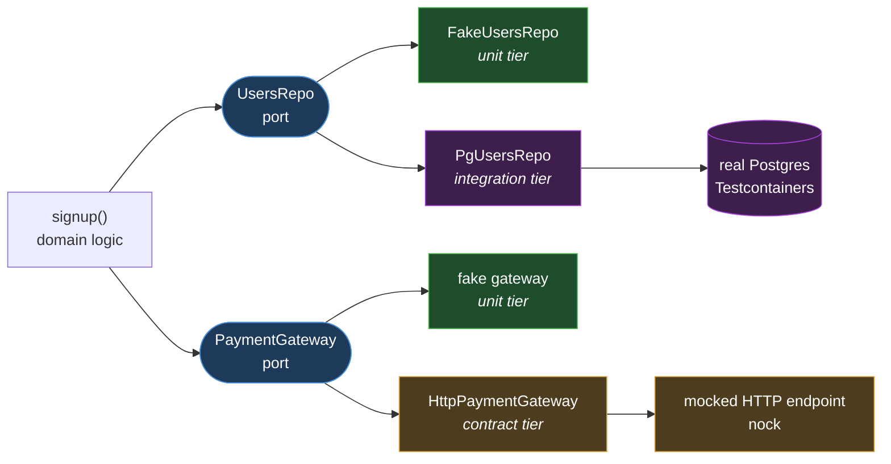
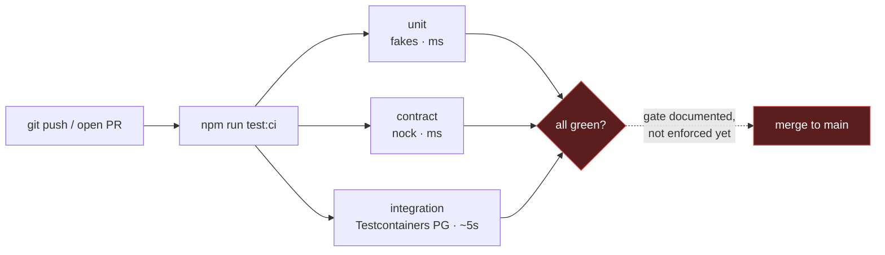

# greenfield-testing-example

A reference CI testing setup for a new service. The point it makes: **every tier
that depends only on infrastructure you control runs in CI on every PR** — you do
not need shared staging to have real integration coverage.

## The one design decision that makes it cheap

Domain logic depends on interfaces ([`src/ports.ts`](src/ports.ts)), never on
`pg` or `fetch` directly. That single seam is what lets each test tier swap in a
different kind of dependency without touching the logic. Retrofitting this into a
codebase that calls the database and HTTP clients inline everywhere is the
expensive part — so you do it from commit #1.

The `signup` logic depends on two ports, and each test tier supplies a different
implementation of them. Same logic under test, three different dependencies.



## The three tiers

| Tier | File | Dependency | Speed | In CI? |
|---|---|---|---|---|
| **Unit** | [`tests/unit`](tests/unit) | in-memory fakes | ms | yes |
| **Contract** | [`tests/contract`](tests/contract) | third-party API **mocked** with [nock](https://github.com/nock/nock) | ms | yes |
| **Integration** | [`tests/integration`](tests/integration) | **real Postgres** in Docker via [Testcontainers](https://testcontainers.com/) | seconds | yes |

- **Unit** covers every branch of the logic with zero I/O.
- **Contract** pins the wire format of the payment adapter. A provider schema
  change breaks the build, but no real API is ever called in CI (no quota, no
  flakiness, no rate limits).
- **Integration** runs against a real Postgres container with the real
  migrations, so it catches what an in-memory fake cannot — for example the
  `UNIQUE(email)` constraint. A fresh container per run means no shared-state
  flakiness and nothing to clean up.

## What is deliberately NOT here

- **No in-memory / SQLite substitute for Postgres.** Fakes diverge from prod on
  exactly the things integration tests exist to catch (constraints, JSONB,
  transactions). Use a real container.
- **No live suite against a deployed environment.** That belongs in a
  scheduled/post-deploy job, not per-PR — add it once something is deployed to
  hit. Third parties that are rate-limited or expensive stay on that gate, not
  on every PR (contract tests cover their interface).
- **No per-PR ephemeral full-stack environment.** Real value, real ops cost. Add
  it when multiple services start drifting against each other, not on day one.

## Run it

```bash
npm ci
npm run test:unit          # fakes, instant
npm run test:contract      # nock, instant
npm run test:integration   # needs Docker running (Testcontainers)
npm run test:ci            # all three - what CI runs
```

CI is [`.github/workflows/ci.yml`](.github/workflows/ci.yml): `npm ci` then
`npm run test:ci`. GitHub's `ubuntu-latest` runners ship Docker, so the
Testcontainers tier works with no extra setup.



The dashed edge is the one gap this repo owns, described next.

## Known limitation - CI here is advisory, not an enforced gate

A principle this repo argues for is "make the gate the enforcement" - CI that
merely runs is advisory, only a required status check actually blocks a red PR
from merging. This repo does not fully practice that yet. Branch protection and
rulesets on a **private** repo require a paid GitHub plan, and this repo is
private on the free plan, so GitHub returns:

> Upgrade to GitHub Pro or make this repository public to enable this feature. (HTTP 403)

The result: the workflow runs and reports on every PR, but nothing stops a
failing PR being merged. The pipeline is real, the gate is documentation.

To make the gate real, pick one:

- **Make the repo public** - unlocks free branch protection via rulesets, then
  require the `test` check before merge. Cleanest for a reference repo with
  nothing sensitive in it.
- **Upgrade to GitHub Pro** - keeps it private and enables protection.

On a real greenfield project this is a day-one setup step, not an afterthought:
require the CI check on the default branch before the first feature merges.
